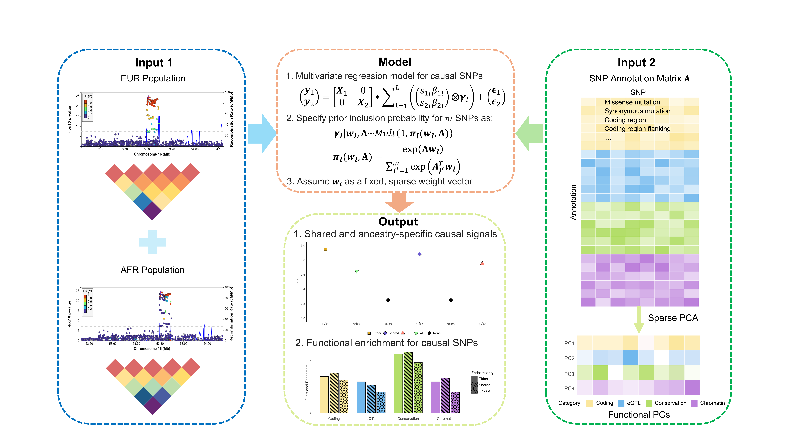

# INFUSE

**INFUSE**: **IN**tegrating **F**unctional annotations into m**U**lti-ancestry fine-mapping via **S**um of single **E**ffect model.



## Overview

INFUSE is an R package for multi-ancestry GWAS fine-mapping using summary statistics. Two key features distinguish it from existing methods:

- **Functional annotation integration.** INFUSE learns SNP-level causal priors from sparse principal components of high-dimensional functional annotation matrices, such as BaselineLF v2.2. This enables signal-specific prior modeling across hundreds of correlated genomic features while reducing overfitting and improving interpretability.

- **Joint LD-discrepancy detection.** INFUSE includes a multi-ancestry diagnostic that jointly detects LD mismatches and allele flips across ancestries before fine-mapping. Compared with applying single-ancestry diagnostics separately, this joint test improves sensitivity while preserving false discovery control.

## Installation

```r
# Install devtools if needed
install.packages("devtools")

# Install from GitHub
devtools::install_github("gchen4422/INFUSE")

# Load the package
library(INFUSE)
```

## Example data

A ready-to-use example dataset is bundled with the package:

```r
data(infuse_example)

R_mat_list           <- infuse_example$R_mat_list           # LD matrices (EUR, AFR)
summary_stat_sd_list <- infuse_example$summary_stat_sd_list # GWAS summary stats
annot_file_all       <- infuse_example$annot_file_all       # 1432 x 186 annotation matrix
ancestry_weight      <- infuse_example$ancestry_weight      # prior weights c(3,3,1)/7
```

## Core functions

### `infuse_core()`

```r
infuse_core <- function(
  R_mat_list,              # named list of LD correlation matrices by ancestry (SNP x SNP)
  summary_stat_list,       # named list of data.frames with SNP, A1, A2, BETA, SE (harmonized, same SNP order)
  L,                       # integer: max number of causal signals
  residual_variance = NULL,
  prior_weights = NULL,    # optional numeric vector length m (per-SNP prior multipliers)
  ancestry_weight = NULL,  # optional named numeric vector (e.g., c(EUR = 0.6, AFR = 0.4))
  optim_method = "optim",
  estimate_residual_variance = FALSE,
  max_iter = 100,
  cor_method = "min.abs.corr",
  cor_threshold = 0.5,
  annot = NULL,            # SNP x feature matrix/data.frame aligned to SNP order
  annot_method = NULL,     # e.g., "mlk" for sparsePCA, "glm", or NULL
  est_annot_prior = "fixed"
)
```

#### Arguments

- **`R_mat_list`**  
  Named list of ancestry-specific **LD correlation matrices** (symmetric; identical SNP IDs and identical SNP order across ancestries).

- **`summary_stat_list`**  
  Named list of GWAS summary-stat data.frames aligned to LD. Required columns: `SNP`, `A1`, `A2`, `BETA`, `SE` (optionally `CHR`, `BP`). Alleles should be uppercase and harmonized across ancestries.

- **`L`**  
  Integer: maximum number of causal signals to model for the region.

- **`residual_variance`**  
  Numeric or `NULL`. If `NULL`, use default or estimate when `estimate_residual_variance = TRUE`.

- **`prior_weights`**  
  Optional numeric vector of length *m* (per-SNP prior multipliers), aligned to SNP order.

- **`ancestry_weight`**  
  Optional **named** numeric vector weighting ancestries in the joint objective (e.g., `c(EUR = 0.6, AFR = 0.4)`).

- **`optim_method`**  
  Optimizer choice (default `"optim"`).

- **`estimate_residual_variance`**  
  Logical. If `TRUE`, estimate residual variance.

- **`max_iter`**  
  Integer: maximum optimization iterations.

- **`cor_method`, `cor_threshold`**  
  Internal correlation/LD-consistency handling (defaults `"min.abs.corr"` and `0.5`).

- **`annot`**  
  Annotation matrix/data.frame (SNP × features), rows aligned to SNP order.

- **`annot_method`**  
  How to use annotations (e.g., `"mlk"` for sparse PCA, `"glm"`, or `NULL`).

- **`est_annot_prior`**  
  Annotation-prior mode (e.g., `"fixed"`).

---

### `kriging_rss_joint()` — Joint multi-ancestry LD-discrepancy test

Run this before `infuse_core()` to flag and remove variants with LD mismatches or allele flips. Unlike single-ancestry diagnostics, it stacks z-scores from both ancestries into a joint model, giving higher sensitivity.

```r
# Run diagnostic
diag <- kriging_rss_joint(z_eur, z_afr, R_eur, R_afr, n1 = 193593, n2 = 60760)
diag$plot  # inspect; red points = candidate mismatches

# Remove flagged SNPs
bad_snps <- diag$conditional_dist$logLR_joint > 2 &
            abs(diag$conditional_dist$z_std_diff) > 4
clean_idx <- which(!bad_snps[seq_along(z_eur)])
```

---

## Analysis code

Simulation and real-data analysis scripts accompanying the manuscript are available at:
[https://github.com/gchen4422/INFUSE_analysis](https://github.com/gchen4422/INFUSE_analysis)

---

## Runtime and reproducibility notes

INFUSE may rely on numerical linear algebra routines that use multi-threaded BLAS, LAPACK, or OpenMP backends. On shared computing environments, such as HPC clusters, uncontrolled multi-threading can lead to CPU oversubscription, unstable runtime, and small numerical differences across runs.

To improve runtime stability and numerical reproducibility, we recommend limiting the number of threads used by common linear algebra backends before running INFUSE.

For shell-based workflows or Slurm jobs, add the following lines before launching R:

```bash
export OPENBLAS_NUM_THREADS=1
export OMP_NUM_THREADS=1
export MKL_NUM_THREADS=1
export VECLIB_MAXIMUM_THREADS=1
export NUMEXPR_NUM_THREADS=1
```

For example, in a Slurm job script:

```bash
#!/bin/bash
#SBATCH --job-name=infuse
#SBATCH --cpus-per-task=1
#SBATCH --mem=16G
#SBATCH --time=24:00:00

export OPENBLAS_NUM_THREADS=1
export OMP_NUM_THREADS=1
export MKL_NUM_THREADS=1
export VECLIB_MAXIMUM_THREADS=1
export NUMEXPR_NUM_THREADS=1

Rscript run_infuse.R
```

For RStudio, these variables can be set before loading INFUSE:

```r
Sys.setenv(
  OPENBLAS_NUM_THREADS = "1",
  OMP_NUM_THREADS = "1",
  MKL_NUM_THREADS = "1",
  VECLIB_MAXIMUM_THREADS = "1",
  NUMEXPR_NUM_THREADS = "1"
)

library(INFUSE)
```

For repeated analyses, we recommend adding these settings to an `.Renviron` file so they are applied automatically when R starts:

```bash
OPENBLAS_NUM_THREADS=1
OMP_NUM_THREADS=1
MKL_NUM_THREADS=1
VECLIB_MAXIMUM_THREADS=1
NUMEXPR_NUM_THREADS=1
```

These settings are especially useful when running many loci in parallel, where each job should typically use a single computational thread unless the user explicitly allocates additional CPUs per task.

